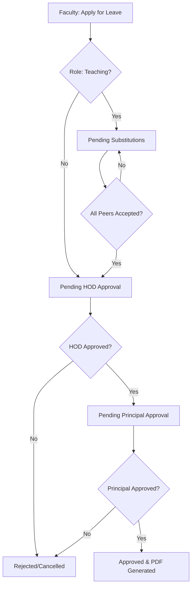
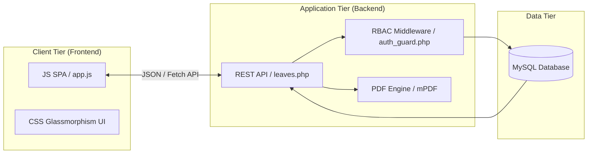
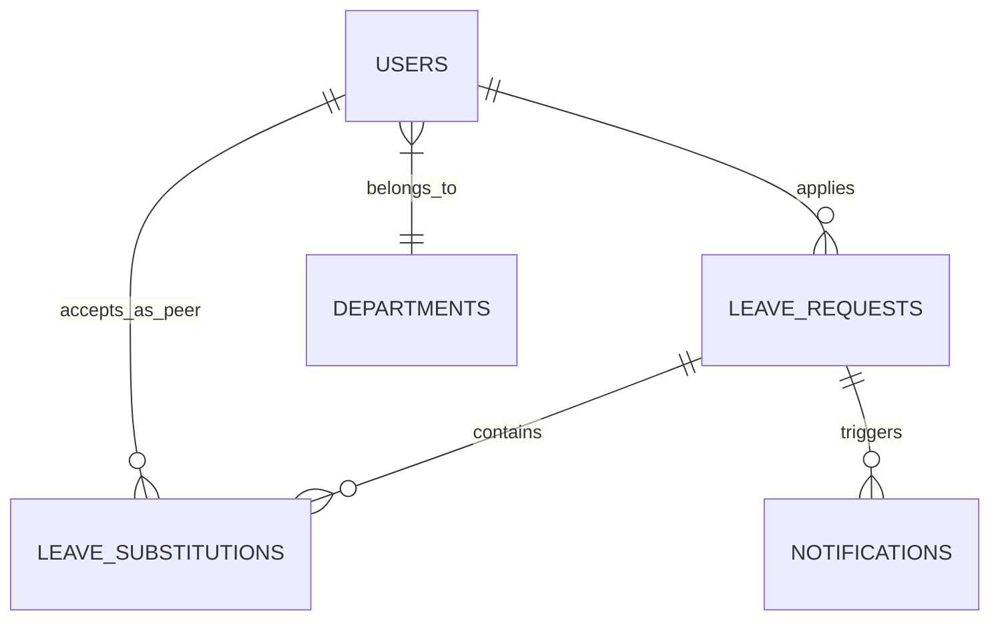

# Diagram and Figure Guide for IEEE Paper

To make your paper submission-ready for an IEEE conference, you should include at least three key figures. Below are the specific descriptions and structural code (Mermaid) for these diagrams.

## Figure 1: Leave Request Lifecycle (Workflow Diagram)
**Location**: Section IV (Proposed System)
**Description**: Shows the state transitions from application to final approval, highlighting the mandatory substitution step.

## Figure 2: System Architecture (Component Diagram)
**Location**: Section V (System Architecture)
**Description**: Illustrates the connection between the JS Frontend, PHP API, and MySQL Database.

## Figure 3: Database Schema (ER Diagram)
**Location**: Section VI (Methodology)
**Description**: Shows the relationships between users, departments, leave requests, and substitutions.

## Implementation Tips for IEEE Format:
1. **Captions**: Always place figure captions *below* the figure (e.g., *Fig 1. Integrated workflow...*).
2. **Resolution**: If using these Mermaid diagrams, export them as high-resolution PNG or SVG.
3. **Contrast**: Ensure text in diagrams is legible and uses a professional font like Arial or Helvetica.
